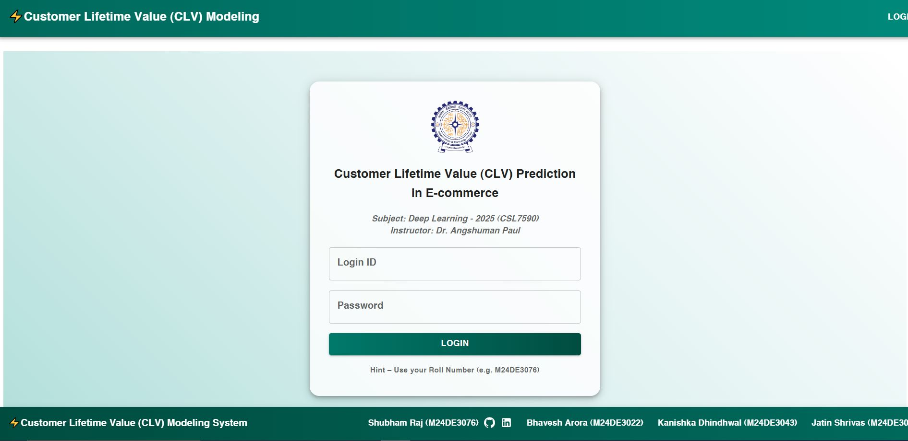
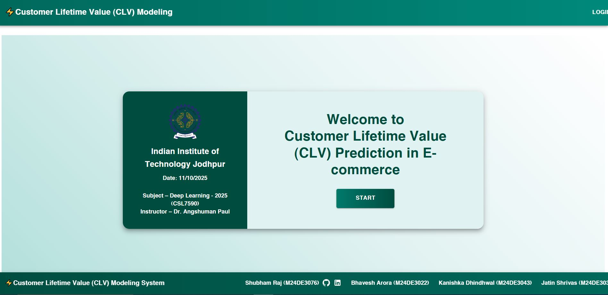
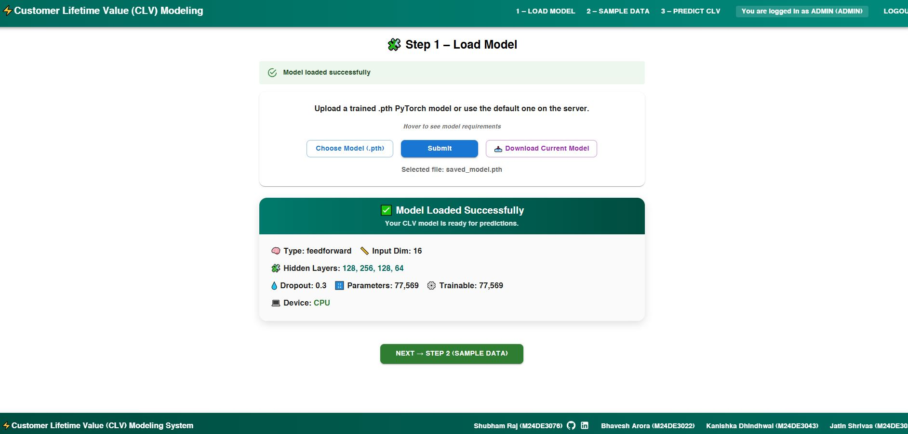
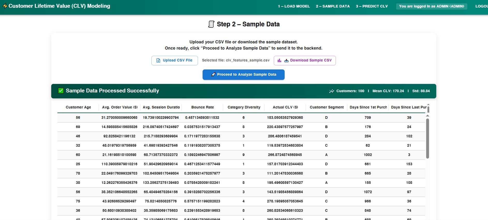
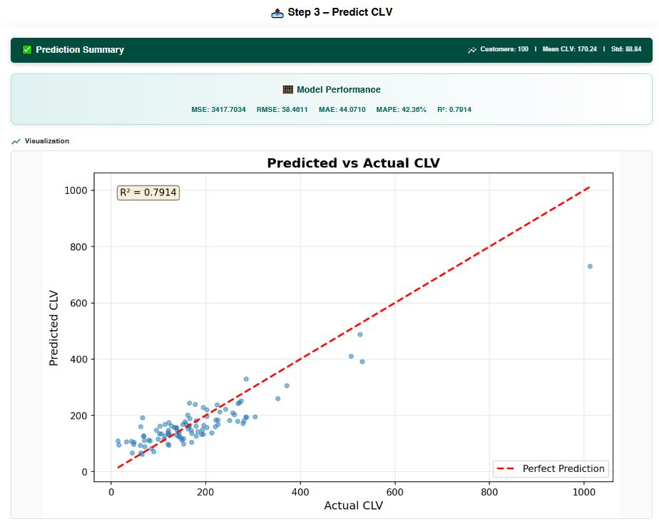
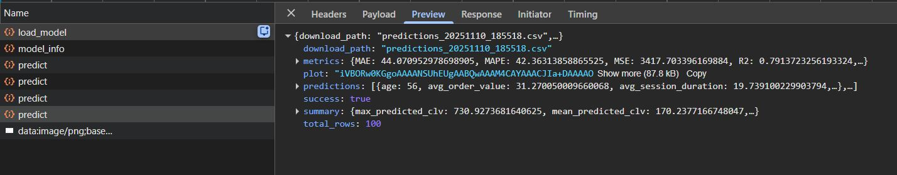
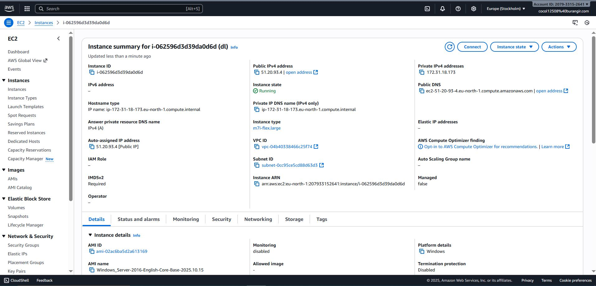

#Customer Lifetime Value (CLV) Modeling
Customer Lifetime Value (CLV) in E-Commerce

[![Contributors][contributors-shield]][contributors-url]  
[![Forks][forks-shield]][forks-url]  
[![Stargazers][stars-shield]][stars-url]  
![Issues][issues-shield]

---

## Overview

A deep learning model implemented in PyTorch for predicting customer lifetime value in e-commerce applications.

---

## Requirements
- **Python 3.10+**
- **Node.js 18+**
- **Flask** for backend
- **React.js** for frontend
- **Redux Toolkit** for state management
- **Material-UI** for UI components

---

## Live Project Links
- **UI:** [http://13.50.9.79:5173/login/](http://13.50.9.79:5173/)
- **Backend:** [http://13.50.9.79:5000/](http://13.50.9.79:5000/)

User Name : **admin** || Password: **admin**  (Default)
---

## Setup Instructions

### Github Link : 
```
https://github.com/shubham14p3/iitj-customer-lifetime-value-prediction-in-e-commerce-dl
```
Clone the project and do the below steps 

### Backend Setup

#### Step 1: Create and Activate Python Virtual Environment

1. **Create a Virtual Environment**:
    ```bash
    python3.10 -m venv venv
    or 
    python -m venv venv
    ```

2. **Activate Virtual Environment**:
   - **Command Prompt**:
     ```bash
     venv\Scripts\activate
     ```
   - **PowerShell**:
     ```bash
     .\venv\Scripts\Activate
     ```
   - **Git Bash**:
     ```bash
     source venv/Scripts/activate
     ```

# Install requirements 
pip install -r requirements.txt  (Only for Python 3.10)
pip install flask-cors

## Dependencies

All required dependencies are listed in `requirements.txt`. Install them using:

```bash
pip install -r requirements.txt
```

### Verify Installation

After installing dependencies, verify your setup:

```bash
python verify_setup.py
```
This will check that all required packages are installed and project modules can be imported correctly.

### Start Backend 

After installing dependencies, verify your setup:

```bash
python app.py
```

### Key Dependencies:
- **PyTorch** (>=2.0.0): Deep learning framework
- **NumPy** (>=1.24.0): Numerical computations
- **Pandas** (>=2.0.0): Data manipulation
- **Scikit-learn** (>=1.3.0): Data preprocessing and metrics
- **Matplotlib** (>=3.7.0): Visualization
- **tqdm** (>=4.65.0): Progress bars


### Backend Setup

#### Step 1: Create and Activate Python Virtual Environment

## Dependencies

All required dependencies are listed in `package.json`. Install them using:


```bash
npm i --f
```
This will install all required packages are installed and project modules can be imported correctly.

### Start Backend 

After installing dependencies, verify your setup:

```bash
npm run start
```

### Project Flow









## Dataset

### Olist Brazilian E-commerce Dataset

This project is designed to work with the **Olist Brazilian E-commerce Dataset**. The dataset contains information about orders, customers, products, and payments from a Brazilian e-commerce platform.

#### Option 1: Using Provided Customer Data (Quick Start)

If you have the `olist_customers_dataset.csv` file (already provided), you can generate a sample CLV dataset:

```bash
python scripts/process_olist_data.py --customers_only --customers_csv olist_customers_dataset.csv --output data/clv_features.csv
```

This creates synthetic CLV features based on customer location data. The processed file will be saved to `data/clv_features.csv`.

#### Option 2: Full Olist Dataset (Recommended for Real Predictions)

For accurate CLV predictions, download the complete Olist dataset:

1. **Download from Kaggle:**
   - Sample Data is present in Step-2 under "Downlaod Sample Data"
   If not "https://limewire.com/d/HBnSV#hKLYEfB3d2" use this for CSV

2. **Required Files:**
   - `olist_customers_dataset.csv` (customer information)
   - `olist_orders_dataset.csv` (order information)
   - `olist_order_items_dataset.csv` (order items with prices)
   - `olist_order_payments_dataset.csv` (payment information)

3. **Extract and Organize:**
   ```bash
   # Create directory structure
   mkdir -p data/olist
   
   # Extract all CSV files to data/olist/
   ```

4. **Process the Dataset:**
   ```bash
   python scripts/process_olist_data.py --data_dir data/olist --output data/clv_features.csv
   ```

This will calculate real CLV features from transaction data including:
- Total orders and revenue
- Average order value
- Purchase frequency
- Days since first/last purchase
- Payment method diversity
- Geographic features

#### Option 3: Using Your Own Dataset

To use your own dataset, prepare a CSV file with:
- **Features**: Customer attributes (demographics, purchase history, engagement metrics, etc.)
- **Target**: A column named `clv` containing the customer lifetime value (optional for prediction)

**Required Features for Predictions:**

The model expects the following features (16 total). Missing features will be filled with mean values from training data, which may result in less accurate predictions:

1. `age` - Customer age (numeric)
2. `gender` - Customer gender (categorical: M, F, Other)
3. `total_orders` - Total number of orders (numeric)
4. `avg_order_value` - Average order value (numeric)
5. `days_since_first_purchase` - Days since first purchase (numeric)
6. `days_since_last_purchase` - Days since last purchase (numeric)
7. `total_page_views` - Total page views (numeric)
8. `avg_session_duration` - Average session duration in seconds (numeric)
9. `bounce_rate` - Bounce rate (0-1, numeric)
10. `return_rate` - Product return rate (0-1, numeric)
11. `category_diversity` - Number of different product categories purchased (numeric)
12. `premium_category_ratio` - Ratio of premium category purchases (0-1, numeric)
13. `email_opens` - Number of email opens (numeric)
14. `email_clicks` - Number of email clicks (numeric)
15. `promo_code_usage` - Whether promo codes are used (0 or 1, numeric)
16. `customer_segment` - Customer segment (categorical: A, B, C, D)

**Example CSV Format:**
```csv
age,gender,total_orders,avg_order_value,days_since_first_purchase,days_since_last_purchase,total_page_views,avg_session_duration,bounce_rate,return_rate,category_diversity,premium_category_ratio,email_opens,email_clicks,promo_code_usage,customer_segment,clv
56,F,5,31.27,709,39,56,19.74,0.46,0.27,6,0.23,9,2,0,D,183.05
```

**Important Notes:**
- Identifier columns (like `customer_id`, `customer_unique_id`) are automatically excluded from features
- If your data has a different structure, you may get identical predictions for all customers. This happens when most required features are missing and get filled with the same default values
- For best results, ensure your data contains all or most of the required features
- You can use `data/clv_features_sample.csv` as a reference for the expected format

## File Descriptions

### `models/clv_model.py`
Contains two model architectures:
- **CLVPredictor**: Feedforward neural network with multiple hidden layers, batch normalization, and dropout
- **CLVLSTMPredictor**: LSTM-based model for sequential customer behavior data

### `data/data_loader.py`
Handles all data operations:
- **CLVDataProcessor**: Main class for loading, preprocessing, and splitting data
- **CLVDataset**: PyTorch Dataset class for efficient data loading
- Features: Automatic categorical encoding, feature scaling, train/val/test splitting

### `utils/trainer.py`
Training utilities:
- **CLVTrainer**: Complete training loop with validation, early stopping, and model checkpointing
- Features: Learning rate scheduling, progress tracking, best model saving

### `utils/evaluator.py`
Evaluation and visualization:
- **CLVEvaluator**: Model evaluation with multiple metrics (MSE, RMSE, MAE, R², MAPE)
- Features: Prediction plotting, residual analysis

### `scripts/train.py`
Main training script with command-line arguments:
- Data loading and preprocessing
- Model creation and training
- Model evaluation on test set
- Model checkpointing

### `scripts/inference.py`
Inference script for making predictions:
- Load trained model
- Evaluate on test data
- Generate predictions and save results
- Create visualization plots

### `scripts/process_olist_data.py`
Data processing script for Olist dataset:
- Processes Olist CSV files to extract CLV features
- Calculates customer lifetime value from transaction data
- Can work with full dataset or generate sample from customer data only

## Usage

### Training

#### Basic Training (with sample data):
```bash
python scripts/train.py
```

#### Training with Processed CLV Dataset:
```bash
# First, process the Olist dataset (if not already done)
python scripts/process_olist_data.py --customers_only --customers_csv olist_customers_dataset.csv --output data/clv_features.csv

# Then train the model
python scripts/train.py --data_path data/clv_features.csv
```

#### Training with Custom Dataset:
```bash
python scripts/train.py --data_path path/to/your/data.csv
```

#### Training with Custom Parameters:
```bash
python scripts/train.py \
    --data_path data.csv \
    --model_type feedforward \
    --hidden_dims 256 512 256 128 \
    --num_epochs 100 \
    --learning_rate 0.0001 \
    --batch_size 128 \
    --save_path models/my_clv_model.pth
```

#### Available Training Arguments:
- `--data_path`: Path to dataset CSV (optional, generates sample data if not provided)
- `--model_type`: Model architecture (`feedforward` or `lstm`)
- `--hidden_dims`: Hidden layer dimensions (space-separated integers)
- `--dropout_rate`: Dropout rate (default: 0.3)
- `--num_epochs`: Number of training epochs (default: 50)
- `--learning_rate`: Learning rate (default: 0.001)
- `--batch_size`: Batch size (default: 64)
- `--patience`: Early stopping patience (default: 10)
- `--save_path`: Path to save trained model (default: `models/saved_model.pth`)

### Inference

#### Evaluate on Test Data:
```bash
python scripts/inference.py \
    --model_path models/saved_model.pth \
    --data_path test_data.csv \
    --input_dim 16
```

#### Generate Predictions and Plots:
```bash
python scripts/inference.py \
    --model_path models/saved_model.pth \
    --data_path test_data.csv \
    --input_dim 16 \
    --output_path predictions.csv \
    --plot
```

#### Available Inference Arguments:
- `--model_path`: Path to trained model checkpoint (required)
- `--data_path`: Path to dataset for evaluation
- `--model_type`: Model architecture type (optional, auto-detected from checkpoint)
- `--input_dim`: Input feature dimension (optional, auto-detected from checkpoint)
- `--output_path`: Path to save predictions CSV
- `--plot`: Generate prediction and residual plots

**Note:** Model configuration is automatically saved with checkpoints, so `--model_type` and `--input_dim` are usually not needed.

## Model Architecture

### Feedforward Network
- **Input Layer**: Accepts customer feature vector
- **Hidden Layers**: Multiple fully connected layers with:
  - Batch normalization
  - ReLU activation
  - Dropout for regularization
- **Output Layer**: Single neuron for CLV prediction

### LSTM Network (Alternative)
- **LSTM Layers**: Process sequential customer behavior
- **Fully Connected Layers**: Map LSTM output to CLV prediction
- Useful for temporal customer data

## Training Process

1. **Data Loading**: Load dataset or generate sample data
2. **Preprocessing**: 
   - Encode categorical variables
   - Scale numerical features
   - Split into train/validation/test sets
3. **Model Training**:
   - Train with early stopping
   - Learning rate scheduling
   - Best model checkpointing
4. **Evaluation**: 
   - Test set evaluation
   - Multiple metrics calculation
   - Visualization generation

## Evaluation Metrics

The model is evaluated using:
- **MSE** (Mean Squared Error)
- **RMSE** (Root Mean Squared Error)
- **MAE** (Mean Absolute Error)
- **R² Score** (Coefficient of Determination)
- **MAPE** (Mean Absolute Percentage Error)

## Model Saving

Trained models are saved as PyTorch checkpoints containing:
- Model state dictionary
- Optimizer state
- Training epoch
- Validation loss
- Training loss


## Web Application (Optional)

A professional Flask web interface is available for presenting the model:

```bash
# Install Flask (if not already installed)
pip install flask>=2.3.0

# Start the web application
python app.py
```

Then open `localhost || IP Address` in your browser.

**Features:**
- Load trained models
- Upload CSV files for prediction
- View predictions in a table
- Download results as CSV
- Visualize predictions with plots
- View model information and metrics

**Important: Data Format for Web Application**

When uploading data for prediction, ensure your CSV file contains the required features (see "Option 3: Using Your Own Dataset" above). The model expects 16 specific features. If your data has a different structure:

- **Problem**: All predictions will be identical (e.g., all R$ 94.52)
- **Cause**: Missing features are filled with the same default values, making all input vectors identical
- **Solution**: Use data with the expected features. You can use `data/clv_features_sample.csv` as a template

**Note:** The web application is optional and not required for core functionality. The project can be used entirely through command-line scripts.

## Notes

1. **GPU Support**: The code automatically uses GPU if available, otherwise falls back to CPU
2. **Reproducibility**: Set random seeds for reproducible results (default: 42)
3. **Data Preprocessing**: The processor must be fitted on training data. The processor is automatically fitted when loading models
4. **Model Configuration**: Model hyperparameters are automatically saved with checkpoints for easier inference
5. **Model Performance**: The included `saved_model.pth` achieves R² = 0.9981, RMSE = 43.23, MAE = 23.32

## Troubleshooting

### Common Issues:

1. **All predictions are identical in web app:**
   - **Cause**: Your uploaded data doesn't contain the required features
   - **Solution**: Use data with the expected 16 features (see "Option 3: Using Your Own Dataset")
   - **Check**: The web app will show an error if too many features are missing
   - **Reference**: Use `data/clv_features_sample.csv` as a template

2. **"Data structure mismatch" error:**
   - Your data doesn't have enough of the required features
   - Process your raw data to extract CLV features first (see `scripts/process_olist_data.py`)

3. **"Processor not fitted" error:**
   - Ensure `data/clv_features.csv` or `data/clv_features_sample.csv` exists
   - The processor needs training data structure to match features correctly

4. **CUDA Out of Memory**: Reduce batch size using `--batch_size`
5. **Input Dimension Mismatch**: Ensure `--input_dim` matches your feature count
6. **Missing Dependencies**: Install all requirements: `pip install -r requirements.txt`
7. **Model Loading Errors**: Ensure model architecture matches saved checkpoint

## Future Improvements

- Add support for more model architectures (Transformer, GRU)
- Implement feature importance analysis
- Add hyperparameter tuning utilities
- Support for time-series CLV prediction
- Integration with production deployment tools

## Authors

👤 **Shubham Raj**  
- GitHub: [@ShubhamRaj](https://github.com/shubham14p3)  
- LinkedIn: [Shubham Raj](https://www.linkedin.com/in/shubham14p3/)


👤 **Bhavesh Arora**  

👤 **Kanishka Dhindhwal**  

👤 **Jatin Shrivas**  
---


## Contributions

Feel free to contribute by creating pull requests or submitting issues. Suggestions for improving data processing methods, adding more visualizations, or optimizing the application are welcome.

---

## Show Your Support

Give a ⭐ if you like this project!

---

## Acknowledgments

- Supported by [IIT Jodhpur](https://www.iitj.ac.in/).

---

<!-- MARKDOWN LINKS & IMAGES -->

[contributors-shield]: https://img.shields.io/github/contributors/shubham14p3/iitj-customer-lifetime-value-prediction-in-e-commerce-dl.svg?style=flat-square
[contributors-url]: https://github.com/shubham14p3/iitj-customer-lifetime-value-prediction-in-e-commerce-dl/graphs/contributors
[forks-shield]: https://img.shields.io/github/forks/shubham14p3/iitj-customer-lifetime-value-prediction-in-e-commerce-dl.svg?style=flat-square
[forks-url]: https://github.com/shubham14p3/iitj-customer-lifetime-value-prediction-in-e-commerce-dl/network/members
[stars-shield]: https://img.shields.io/github/stars/shubham14p3/iitj-customer-lifetime-value-prediction-in-e-commerce-dl.svg?style=flat-square
[stars-url]: https://github.com/shubham14p3/iitj-customer-lifetime-value-prediction-in-e-commerce-dl/stargazers
[issues-shield]: https://img.shields.io/github/issues/shubham14p3/iitj-customer-lifetime-value-prediction-in-e-commerce-dl.svg?style=flat-square
